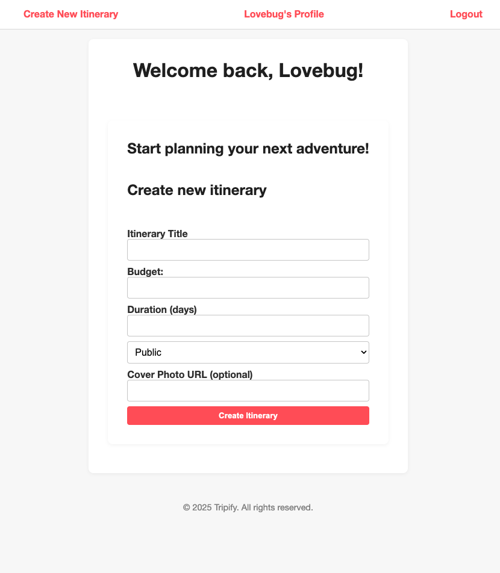

# Tripify
Tripify is a web application that allows users to create, view, edit, and manage travel itineraries. Each itinerary includes trip details like duration, budget, and privacy settings. Users can plan their days with activities that include specific information like time, location, and description.
#
Link to deployed project: N/A (not deployed yet)

# Attributions
This project was inspired by Trip Genius,<a href="https://www.airbnb.com/"> AirBnB </a>.

This project uses express-ejs-layouts to streamline page templating and maintain a consistent structure across views. Learn more at <a href="https://github.com/soarez/express-ejs-layouts">express-ejs-layouts</a> on GitHub or <a href="https://www.npmjs.com/package/express-ejs-layouts">NPM</a>. This approach was inspured by a timecrunch, that led to the discovery of <a href="https://www.digitalocean.com/community/tutorials/how-to-use-ejs-to-template-your-node-application">this tutorial from DigitalOcean </a>

This project uses a custom modal popup to display activity details within an itinerary without navigating to a separate page. Clicking on an activity title dynamically opens a modal showing its title, description, time, and location. This improves the user experience by keeping interactions smooth and contextually focused. Resources used for implementing modals include <a href="https://developer.mozilla.org/en-US/docs/Web/HTML/Element/dialog">MDN Web Docs</a> and <a href="https://www.w3schools.com/howto/howto_css_modals.asp"> W3Schools Modal Tutorial</a>.

Link to <a href="https://trello.com/b/Rmx7s7YC/unit-2-project-planning">Trello planning board </a>

# Technologies Used
- **JavaScript**
- **Node.js**
- **Express.js**
- **EJS**
- **Express-EJS-Layouts**
- **MongoDB** with **Mongoose**
- **express-session**
- **method-override**
- **bcrypt**
- **CSS3 with Flexbox**

## Next Steps
This is just the start for Tripify, exciting enhancements are soon to come, most notably:
- Add guests and followers
    - **Guests** will be able to be added to the itinerary and granted specific permissions set by the itinerary's original creator to enable collaboration on shared itineraries
    - **Followers** can follow their favorite itinerary creators, and like, save, and copy existing itineraries.
- Track Trips
    - Users will be able to track where in the world they've been
    - by using the world view, users can also find itineraries specifically by the location that is being travelled to.
- Enhanced Itinerary Macrodata
    - users will be able to upload files, photos, and other notes for their itineraries, to be able to keep documents organized for trips.

## Any suggestions?
Feel free to let me know what you would want to see next in Tripify!
